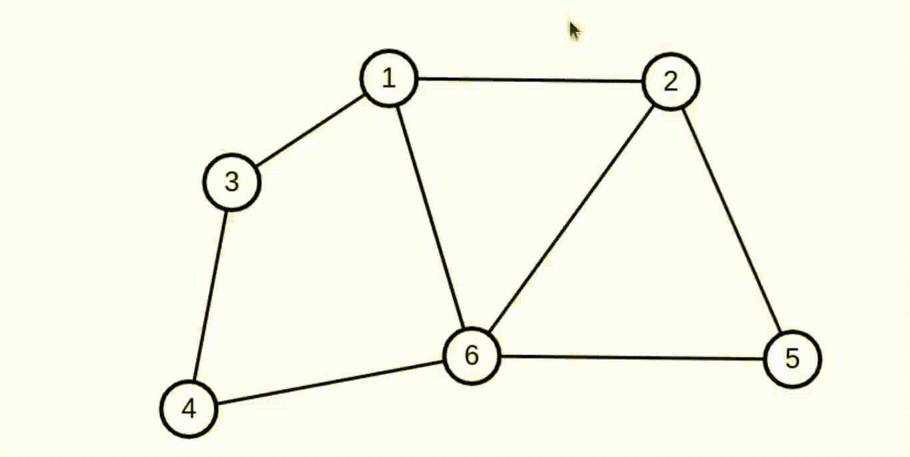
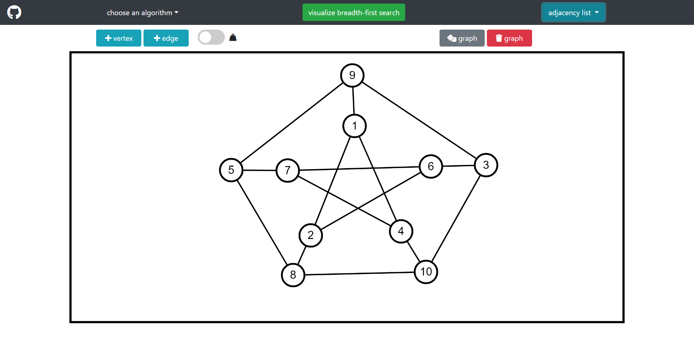

# graphTheory-Visualizer

Project made to visualize operations that can be done in a graph, such as BFS,DFS,Kruskal and Dijkstra.\
The goal was to have a continuous display of the various operations, so that if the graph changes while the operation is in progress, the display changes too.

You can access it here: https://giggiox.github.io/graphTheory-Visualizer/    

example of BFS:

&NewLine;
dijkstra shortest path between 2 vertices:

&NewLine;
interface:

&NewLine;
Project made using [p5js](https://p5js.org/) and [TypeScript](https://www.typescriptlang.org/).

